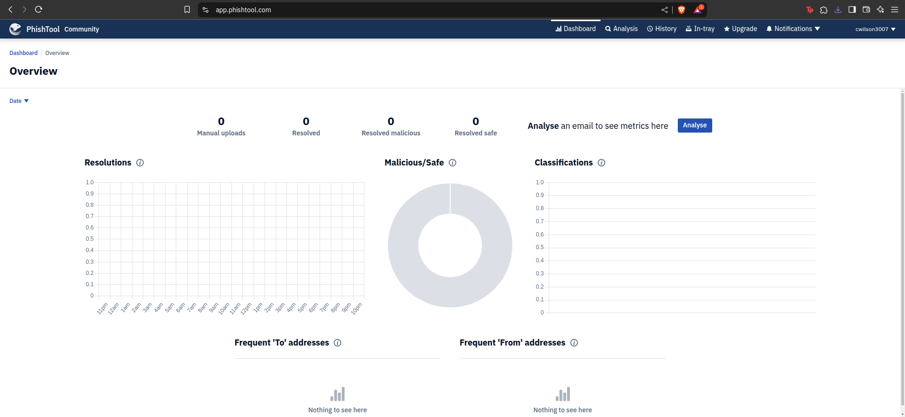
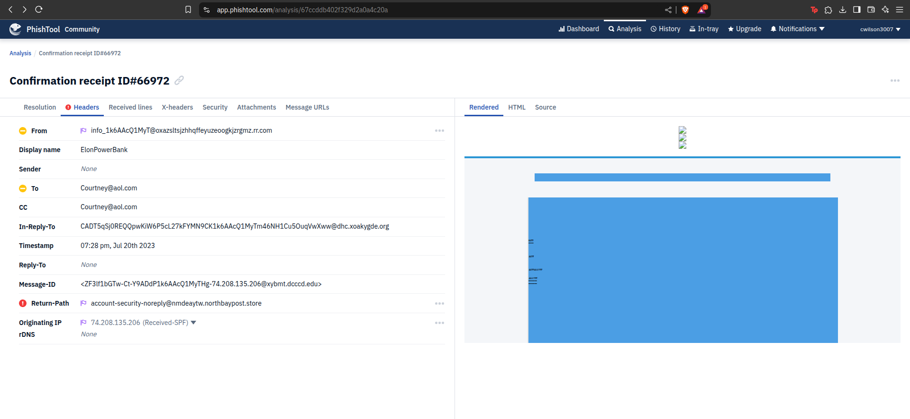
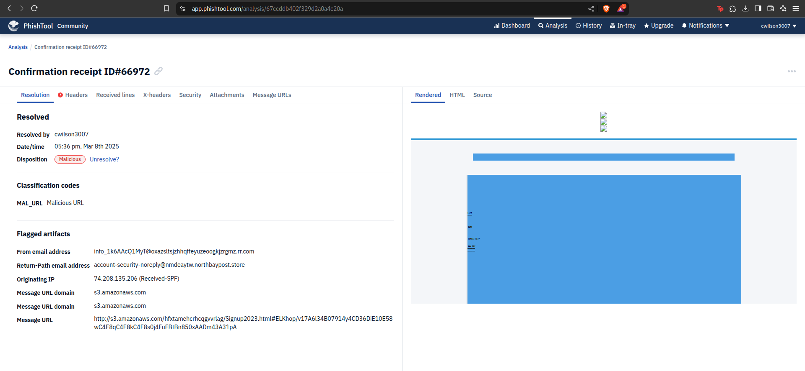
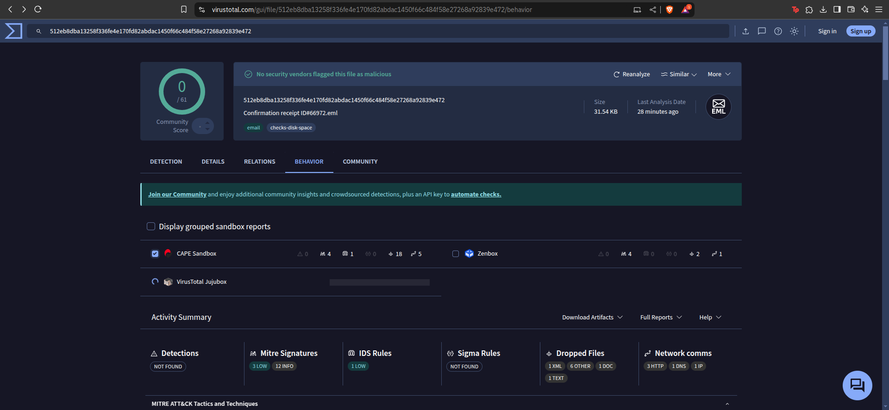

# 🐠 Phishing Email Investigation (Online Tools) 🔎

> A concise, web-based analysis of a phishing email (titled **“Confirmation receipt ID_66972”**).  
> Demonstrates how to **manually** review and flag a suspicious email as malicious in **PhishTool**, 
> plus a **CAPE Sandbox** check via **VirusTotal**, including an exported **HTML report** with detailed malicious indicators.

---

## 🌐 Project Overview
1. **PhishTool (Landing → Headers → Results)**  
   - Logged in to the PhishTool **online** dashboard.  
   - Inspected the email’s headers for spoof indicators and domain mismatches.  
   - **Manually** labeled the email as **Malicious** after seeing enough red flags.  

2. **VirusTotal CAPE Sandbox**  
   - Uploaded the same `.eml` file to VirusTotal.  
   - Reviewed deeper **behavioral** indicators (network calls, dropped files).  
   - Exported an **HTML report** (`CAPE_Sandbox_Report.html`) to document the sandbox findings.

---

## 🚀 Quick Steps
1. **Login to PhishTool** → Confirm you can analyze suspicious emails via the dashboard.  
2. **Upload the `.eml`** → Inspect “Headers,” “Security,” “Attachments,” etc.  
3. **Flag as Malicious** → Once you identify spoofing, malicious URLs, or questionable domains.  
4. **CAPE Sandbox on VirusTotal** → For advanced threat intel (dropped files, communications, etc.).  
5. **Export CAPE HTML** → Save a local copy of the sandbox analysis, then upload it here for reference.

---

## 🖼️ Screenshots

### 1️⃣ PhishTool Landing Page

> **Description**: The default overview page after logging in, showing resolution stats and classification charts.

---

### 2️⃣ PhishTool Header Analysis

> **Description**: Under “Headers,” we see suspicious domain references, potential mismatched SPF, 
> and questionable “Reply-To” fields.

---

### 3️⃣ PhishTool Results (Malicious Flag)

> **Description**: After examining all tabs, I manually flagged this email as **Malicious**. 
> The “Resolution” tab now shows “Disposition: Malicious,” along with flagged artifacts.

---

### 4️⃣ VirusTotal - CAPE Sandbox

> **Description**: While no AV vendors flagged it outright, the **CAPE Sandbox** reveals deeper 
> behavioral indicators (dropped files, potential network calls, etc.).

---

## 📄 CAPE Sandbox Full Report
**File Name**: [CAPE_Sandbox_Report.html](./CAPE_Sandbox_Report.html)  
Below is a **summary** of the report’s key points (full details in the HTML):

- **File Type**: SMTP Mail (`.eml`), ~32,302 bytes  
- **SHA-256**: `512eb8dba13258f336fe4e170fd82abdac1450f66c484f58e27268a92839e472`  
- **Flagged in**: VirusTotal, MWDB, Bazaar  

### Signatures Detected (Possible Malicious Behavior)
- Memory checks, host fingerprinting, and anti-analysis tactics (`SetUnhandledExceptionFilter`, geofencing)
- Potential buffer overflow exploit (heap spray, stack pivoting)
- Possible encryption/ransomware keys generated (WinCrypto APIs)
- **Network attempts** not found in PCAP (hidden comms), plus failed IP:Port contacts (C2 attempts?)
- Mimics system’s user-agent (bypass detection), displays a decoy document, initiates network communication

### Dropped Files & Network Activity
- Created hidden/system files (`~WRS{...}.tmp`, `PerfStringBackup.INI`, etc.)
- Potential payload disguised as email attachment (`.dat` files)
- Tried connecting to a **dead IP:Port** (C2 communication attempt failed)
- Made HTTP and HTTPS requests with a **mimicked user-agent**

### Behavior Analysis
- **Executed Processes**: Outlook `.eml` opened, system services (services.exe, svchost.exe, WmiPrvSE.exe)
- **Created Mutexes**: Possibly for persistence (e.g., `Local\_outlook_mutex_`, `Global\552FFA80...`)
- Suggests **phishing attacks** delivering malware or obtaining credentials

### Conclusion
- **High likelihood** of malicious intent, indicated by memory tampering, hidden network traffic, and potential exploitation steps.
- **Next Steps**:
  - Avoid opening in a live production environment
  - Inspect dropped files for hidden executables/scripts
  - Monitor for persistent processes or registry changes

---

## 🔎 Key Observations
- **From/Reply-To Mismatch**: Suggests spoofing or domain tampering.
- **Suspicious Return-Path**: `account-security-noreply@nmdeaytw.northbaypost.store`—unrelated to the supposed sender.
- **Manual Malicious Flag**: In PhishTool, I had to confirm the malicious disposition after verifying all evidence.
- **CAPE Sandbox**: Confirms advanced malicious behavior despite minimal initial AV detections.

---
## 🔚 Summary

- **Key Indicators**: Spoofed domain, mismatched SPF, suspicious attachments.
- **Malicious Verdict**: Email flagged after manual verification in PhishTool.
- **Sandbox Findings**: CAPE analysis showed memory tampering, potential network calls, and anti-analysis tricks.
- **Next Steps**: Avoid opening in a live environment, scan any related attachments, and monitor for persistent artifacts.

This project demonstrates real-world phishing analysis via online tools, useful for SOC or Threat Intel roles.

